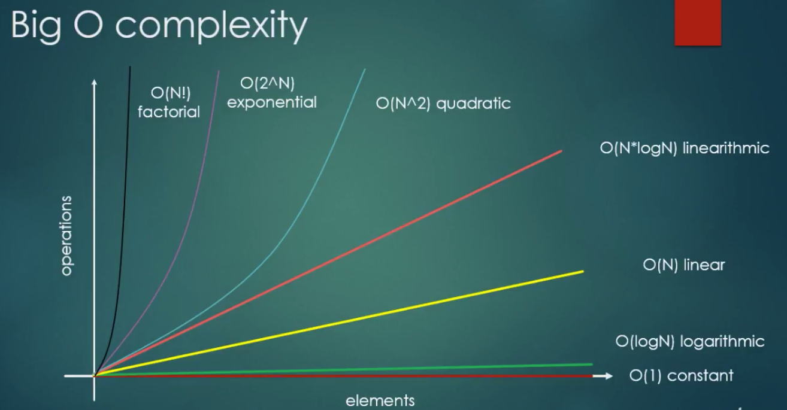

# python-data-structures-and-algorithms

## Big O notation

This notation provides an upper bound on the growth rate of a function.

It describes the limiting behavior of a function when the argument tends to a particular value or infinity.

Time complexities

### Constant function - O(1)
`f(n) = c`
Example: swap two numbers;

- O(logN) - Search in a sorted array with binary search;
- O(N) - Search for a max element in an unsorted array;
- O(N*logN) - Mergesort, quicksort, heapsort;
- O(N^2) - bubble sort
- O(2^N) - Travelling salesman problem with dynamic programming;
- O(N!) - Traveling salesman problem with brute force search;

Try to reduce algorithms complexity to `linear` or `logarithmic` time complexity.

## LinkedList an ArrayList

Each node is composed of `data` and a `reference` to the next node in the sequence.

Time complexity based on activities:
- LinkedList (Dynamic data structures)
    - Indexing: O(n)
    - Insert at the beginning:  O(1)
    - Wast space: O(n) since we also store the reference to the next element.
- ArrayList
    - Indexing: O(1)
    - Insert at the beginning: O(n) we have to reallocate every other element in memory
    - Wast space: 0

### Advantages

Use linked lists to inser/remove elements or if the list size changes frequently.

Use arrays if you need random access to the elements.

Linked lists allocate memory in run-time

Store items with different sizes whereas arrays assume all elements have the same size.

### Disadvantages

Nodes must be read in a sequencial order.

Difficult to reverse traversing. To do so we would have to implement doubly linked list.